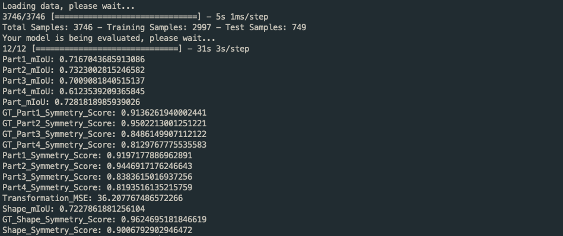
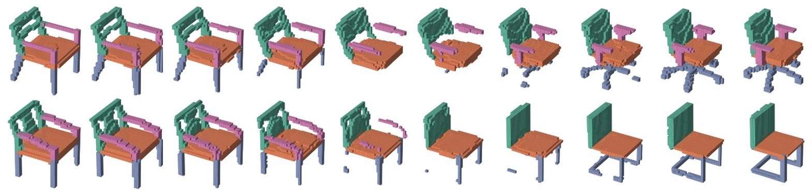
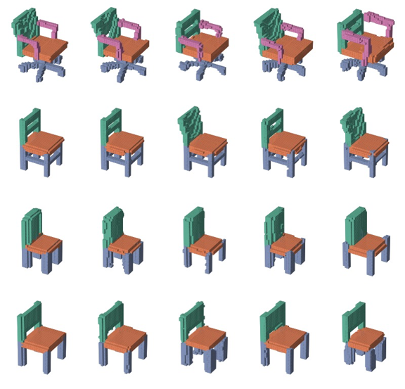
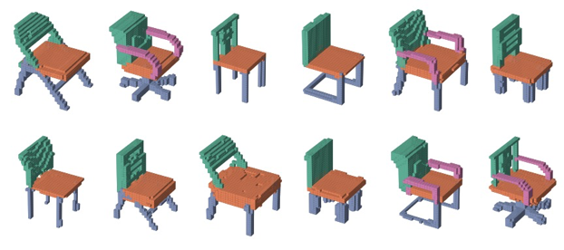

# Attention-based Part Assembly for 3D Volumetric Shape Modeling

## Setup

All necessary packages can be checked in `requirements.txt`. It's a good practice to use python virtual environment 
to set up the programing environment.

To set up python virtual environment: <br>
Follow the [installation instruction of MiniConda](https://docs.conda.io/en/latest/miniconda.html#) and then run 
the following snippet using your favourite terminal application:
```bash
conda create -n py36 python=3.6
conda activate py36
```

To install all necessary packages:
```bash
cd project_root
pip install -r requirements.txt
```

## Dataset

We use [ShapeNetCore](https://shapenet.org/) as our dataset. As for the segmented label, we use 
[shapenetcore_partanno_segmentation_benchmark_v0](https://shapenet.cs.stanford.edu/ericyi/shapenetcore_partanno_segmentation_benchmark_v0.zip), 
which is provided by [A Scalable Active Framework
for Region Annotation in 3D Shape Collections](https://cs.stanford.edu/~ericyi/project_page/part_annotation/).

The table below is a brief introduction of [shapenetcore_partanno_segmentation_benchmark_v0](https://shapenet.cs.stanford.edu/ericyi/shapenetcore_partanno_segmentation_benchmark_v0.zip):

|   class    | num_parts per shape | num_samples | num_points per shape |
|:----------:|:-------------------:|:-----------:|:--------------------:|
|  Airplane  |          4          |    2690     |         2577         |
|    Bag     |          2          |     76      |        	2749         |
|    Cap     |          2	        |     55      |        	2631         |
|    Car     |        	4          |    	898   |        	2763         |
|   Chair    |        	4	         |    3746    |        	2705         |
|  Earphone  |        	3	         |     69	  |         2496         |
|   Guitar   |        	3          |      787    |        	2353         |
|   Knife	  |        2	          |     392     |       2156         |
|    Lamp    |        	4          |   	1546	    |       2198         |
|   Laptop   |        	2	         |     445     |        2757         |
| Motorbike  |         6	          |    202	     |      2735         |
|    Mug     |         2	          |    184	     |      2816         |         
|  Pistol	  |         3	          |     75	     |      2654         |
|   Rocket   |        	3          |    	66	     |      2358         |
| Skateboard |        	3	         |    152	     |      2529         |
|   Table    |        	3	         |    5263	    |       2722         |
|   Total    |        	50	         |    16846    |        2616         |

### Prepare dataset from scratch

#### 1. Obtain `.binvox` files

##### Method 1 (only tested in MacOS)

You can voxelize ShapeNetCore by using `utils/obj_to_binvox.py`:

```bash
python utils/obj_to_binvox.py voxel_grid_resolution obj_category_path output_path 
```

All categories can be downloaded from [here](http://shapenet.cs.stanford.edu/shapenet/obj-zip/), e.g. `03467517.zip`. After downloading and unzipping the category file
you will get `obj_category_path`, e.g. `~/Download/03467517`.


##### Method 2

Download `.binvox` files directly from [here](https://cvgl.stanford.edu/data2/ShapeNetVox32.tgz).


#### 2. Obtain semantic labels for `.binvox` files

Download the semantic labels from [here](https://shapenet.cs.stanford.edu/ericyi/shapenetcore_partanno_segmentation_benchmark_v0.zip). 


#### 3. Generating dataset
 
After obtaining `.binvox` file and its semantic label, run the 
following snippet in your favourite terminal application:

```bash
python utils/data_preprocessing.py voxel_grid_resolution semantic_label_path binvox_category_path output_path
```

For example, `./shapenetcore_partanno_segmentation_benchmark_v0/03001627/` is the semantic label path of the category `chair`. 
`./ShapeNetVox32/03001627/` (Method 2) is the binvox category path of the category `chair`. Output path is the path where you want to save the 
generated data.

For more usage about `data_preprocessing.py`, please run:
```bash
python utils/data_preprocessing.py -h
```

### Using our dataset

chair: [03001627.zip(681MB)](https://gitlab.com/JunweiZheng93/shapenetsegvox/-/raw/master/03001627.zip?inline=false) <br>
number of shapes: 3746 <br>
maximal number of parts: 4 <br>
solid or not: solid <br>
resolution: 32

table: [04379243.zip(666MB)](https://gitlab.com/JunweiZheng93/shapenetsegvox/-/raw/master/04379243.zip?inline=false) <br>
number of shapes: 5263 <br>
maximal number of parts: 3 <br>
solid or not: solid <br>
resolution: 32

airplane: [02691156.zip(278MB)](https://gitlab.com/JunweiZheng93/shapenetsegvox/-/raw/master/02691156.zip?inline=false) <br>
number of shape: 2690 <br>
maximal number of parts: 4 <br>
solid or not: solid <br>
resolution: 32

lamp: [03636649.zip(87MB)](https://gitlab.com/JunweiZheng93/shapenetsegvox/-/raw/master/03636649.zip?inline=false) <br>
number of shapes: 1546 <br>
maximal number of parts: 4 <br>
solid or not: solid <br>
resolution: 32

guitar: [03467517.zip(29MB)](https://gitlab.com/JunweiZheng93/shapenetsegvox/-/raw/master/03636649.zip?inline=false) <br>
number of shapes: 787 <br>
maximal number of parts: 3 <br>
solid or not: not solid <br>
resolution: 32

### Visualize dataset

The generated dataset consists of some PNG images and `.mat` files. To visualize `.mat` files, please run:
```bash
python utils/visualization.py mat_file_path
```

## Training

Our training script is user-friendly. The only thing you need to do is to open your favourite terminal application and
type:
```bash
python train.py 
```

The training script will then download the necessary dataset automatically, place the dataset to the correct directory and
start training according to the hyper-parameter you have set. All results (all hyper-parameters, 
tensorboard logs, model weights in `.h5` format and so on) will be saved automatically in `project_root/results/`.

In order to modify the hyper-parameters for the training, please open `hparam.py` and change the value over there.

## Usage of some useful scripts

### quality_eval.py

#### batch mode

The default mode of `quality.py` is batch mode. That means it will show you a batch of shapes interactively (default values is 4 
shapes and will be picked randomly in the same category). Firstly, the ground truth shape will be shown for shape #1, and then
the model reconstructed shape for shape #1. Secondly, the ground truth shape for shape #2 will be shown and then the model reconstructed
shape for shape #2. The process will go on until shape #4.

To run batch mode, please type:
```bash
python quality_eval.py model_path --category chair
```

For example, if you want to evaluate how good you model is for the category `chair` (assume your model is saved in 
`results/20210723162046/process_3/checkpoint.h5`), you need to type:
```bash
python quality_eval.py results/20210723162046/process_3/checkpoint.h5
```

`chair` is the default category. so you don't need to set value for `--category`.

For more usage of `quality_eval.py`, please type:

```bash
python quality_eval.py -h
```

#### single mode

Single mode allows you to check the visualized result for one specific shape. For example, if you want to evaluate how 
good you model is for the shape `datasets/03001627/1a38407b3036795d19fb4103277a6b93`(it is a shape in catergory `chair`)
and assume your model is saved in `results/20210723162046/process_3/checkpoint.h5`, you should type:
```bash
python quality_eval.py results/20210723162046/process_3/checkpoint.h5 -m single -s datasets/03001627/1a38407b3036795d19fb4103277a6b93
```

For more usage of `quality_eval.py`, please type:

```bash
python quality_eval.py -h
```

### quantity_eval.py

This script is used to calculate numerical metrics for the model, including `Part mIoU`, `Part Symmetry Score`, `Transformation MSE`,
`Shape mIoU`, `Shape Symmetry Score` and so on. The figure below shows the output of `quantity_eval.py` for a model.



To run `quantity_eval.py`, please type:

```bash
python quantity_eval.py model_path
```

For example, assuming the model is saved in `results/20220305221305/process_3/checkpoint.h5`, you need to type:

```bash
python quantity_eval.py results/20220305221305/process_3/checkpoint.h5 
```

For more usage of `quantity_eval.py`, please type:

```bash
python quantity_eval.py -h
```

### utils/pick.py

This script is used to check the quality of the reconstruction for a batch of pre-selective shapes by saving the reconstructed
images under the model file path.

To run `pick.py`, please type:

```bash
python utils/pick.py model_path
```

For more usage of `pick.py`, please type:

```bash
python utils/pick.py -h
```

### utils/reconstruct.py

This script is used to generate the reconstructed images for ori_model_p2, ori_model_p3, notkeepC_model_p2, notkeepC_model_p3,
keepC_model_p2, keepC_model_p3 and stack all images together into one image. The images from left to right are the input ground truth,
reconstruction for ori_model_p2, reconstruction for ori_model_p3, reconstruction for notkeepC_model_p2, reconstruction for notkeepC_model_p3,
reconstruction for keepC_model_p2, reconstruction for keepC_model_p3


To run `reconstruct.py`, please type:

```bash
python utils/reconstruct.py ori_model_p2 ori_model_p3 notkeepC_model_p2 notkeepC_model_p3 keepC_model_p2 keepC_model_p3 --hash_codes code1 code2 code3 --category chair
```

For more usage of `reconstruct.py`, please type:

```bash
python utils/reconstruct.py -h
```

### utils/interpolate.py

This script is used to generate the interpolated images for a trained model and stack all images together into one image. The
two parameters s1 and s2 should contain two hash codes respectively, e.g. `s1=96929c12a4a6b15a492d9da2668ec34c, 2a56e3e2a6505ec492d9da2668ec34c`,
`s2=3c408a4ad6d57c3651bc6269fcd1b4c0, 88aec853dcb10d526efa145e9f4a2693`. `s1` means the hash code of the shape on the left side, 
while `s2` means the shape on the right side. The rest 8 images in the middle in the below demo image are the interpolated shapes.



To run `interpolate.py`, please type:

```bash
python utils/interpolate.py model_path -s1 96929c12a4a6b15a492d9da2668ec34c 2a56e3e2a6505ec492d9da2668ec34c -s2 3c408a4ad6d57c3651bc6269fcd1b4c0 88aec853dcb10d526efa145e9f4a2693 --category chair
```

For more usage of `interpolate.py`, please type:

```bash
python utils/interpolate.py -h
```

### utils/swap.py

This script is used to generate the images for swapping a certain part between two different shapes and stack all images
together into one image. The first column are the ground_truth images. The second column are the reconstructed image for 
ori_model. The third column are the swapped images for ori_model. The fourth column are the reconstructed images for attention 
model. The fifth column are the swapped images for attention model. `which_part` should contain two integers, e.g. 3 and 1, which means 
the 2nd and 3rd column will swap part 3, while 4th and 5th column will swap part 1. `s1` and `s2` should contain two hash_codes respectively, e.g. 
`s1=975ea4be01c7488611bc8e8361bc5303, 9d7d7607e1ba099bd98e59dfd5823115`, `s2=297d3e472bf3198fb99cbd993f914184, 1bbe463ba96415aff1783a44a88d6274`. 
`s1` means the shape in (1st row column, 1st column) and (3rd row, 1st column). `s2` means the shape in (2nd row, 1st column) and (4th row, 1st column).



To run `swap.py`, please type:

```bash
python utils/swap.py ori_model attention_model --which_part 3 1 -s1 975ea4be01c7488611bc8e8361bc5303 9d7d7607e1ba099bd98e59dfd5823115 -s2 297d3e472bf3198fb99cbd993f914184 1bbe463ba96415aff1783a44a88d6274 --category chair
```

For more usage of `swap.py`, please type:

```bash
python utils/swap.py -h
```

### utils/mix.py

This script is used to generate the images for mixing all parts randomly among different shapes and stack all images together 
into one image. The first row are ground truth. The second row are mixed shapes.



To run `mix.py`, please type:

```bash
python utils/mix.py model_path -s hash_code1 hash_code2 hash_code3 --seed 6 --category chair
```

For more usage of `mix.py`, please type:

```bash
python utils/mix.py -h
```

### utils/plot_curve.py

This script is used to generate the curve. You need to export the necessary data from tensorboard first and then change the 
necessary snippets in the script in order to plot the correct curve.

To run `plot_curve.py`, please type:

```bash
python utils/plot_curve.py
```
